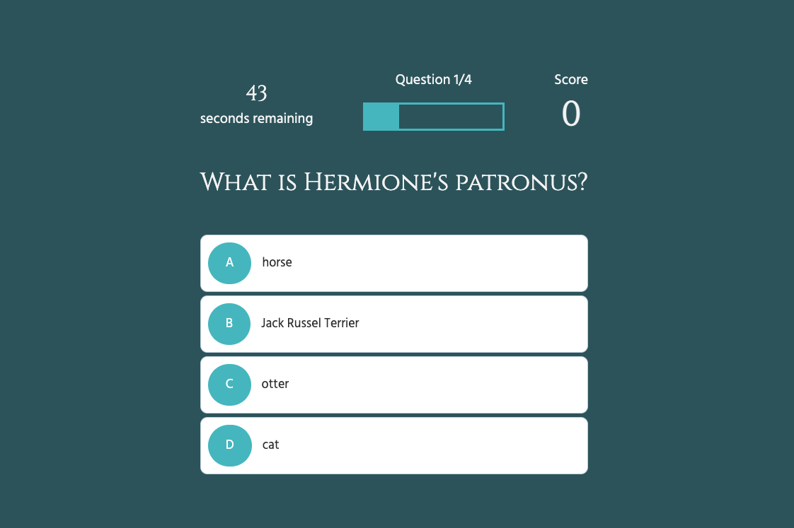

# Code Quiz

## Description

Test your HP knowledge! This quiz uses html, javascript and css. 

## Installation
Use a web browser to access the site:

https://adodt.github.io/quiz-example/

## Usage
The user can start the quiz or view high scores. After starting the quiz they will answer multiple choice questions. At the end of the quiz, the score are displayed and you can view high scores. 

Screenshots of website:

## License
MIT License